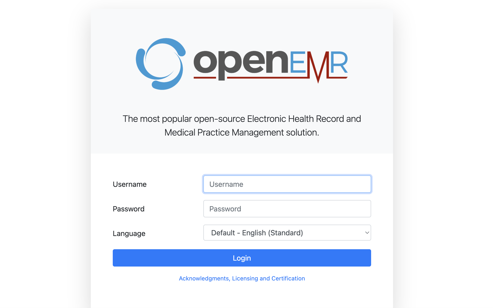
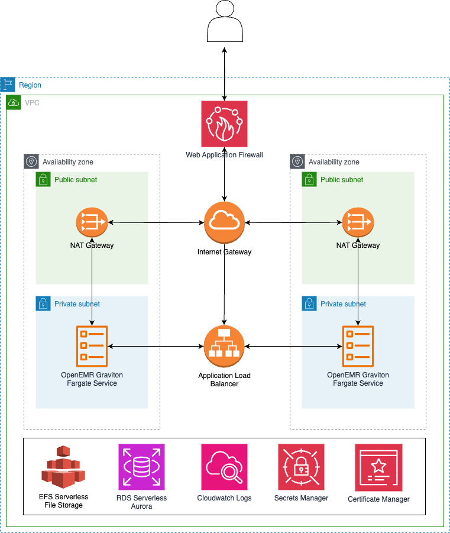
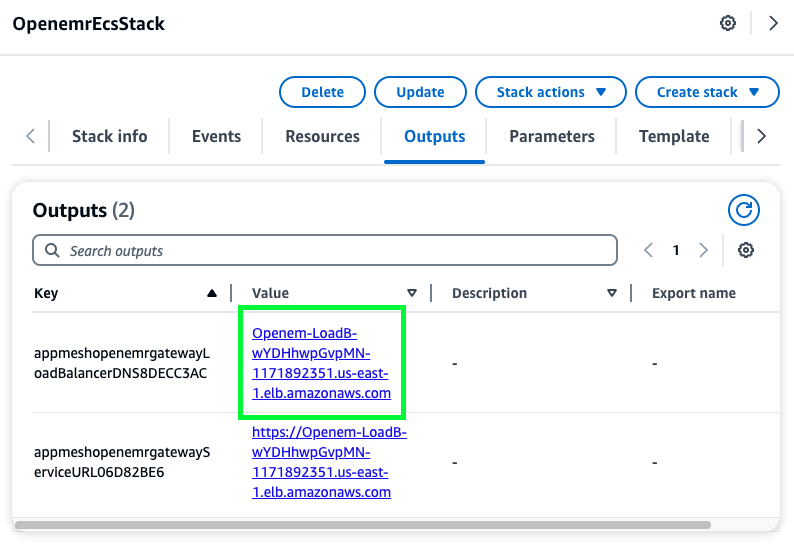
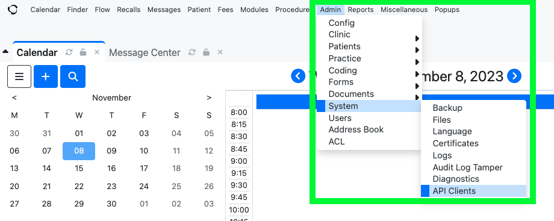
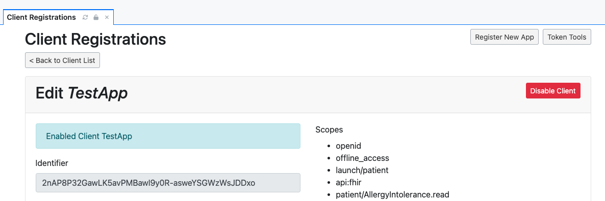
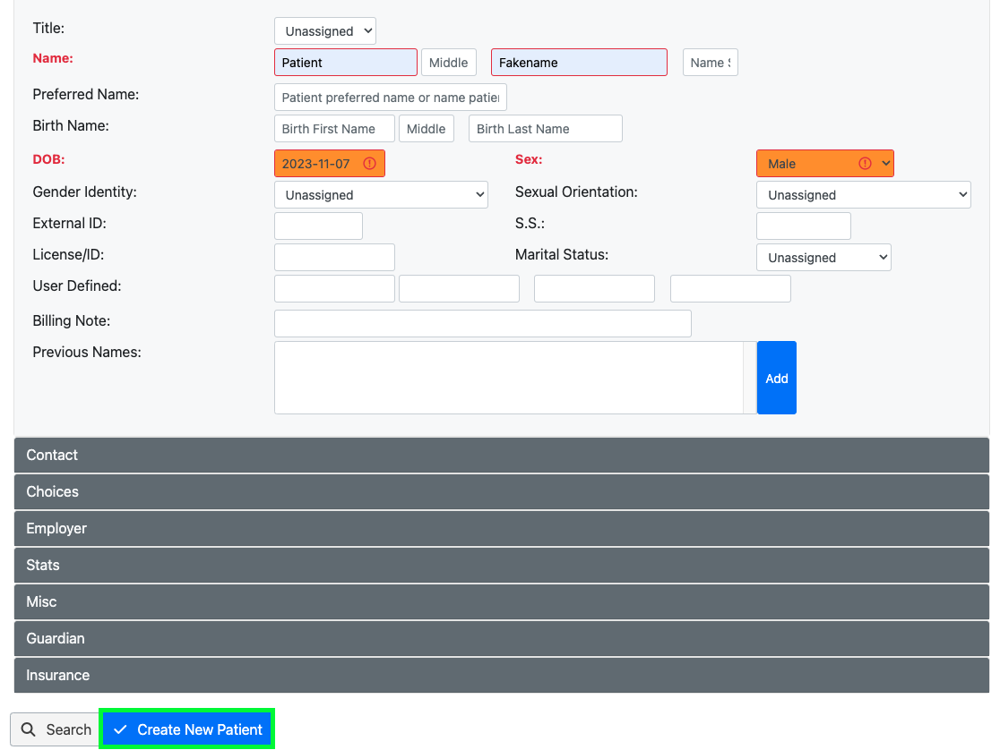
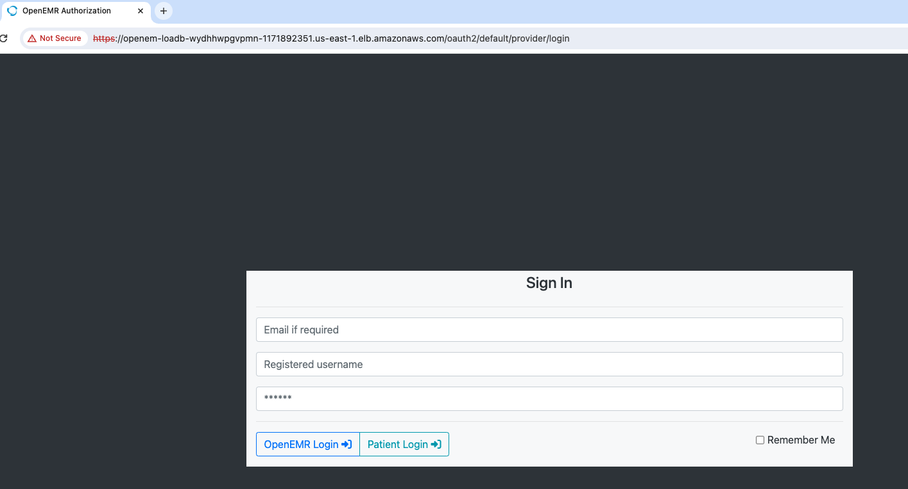
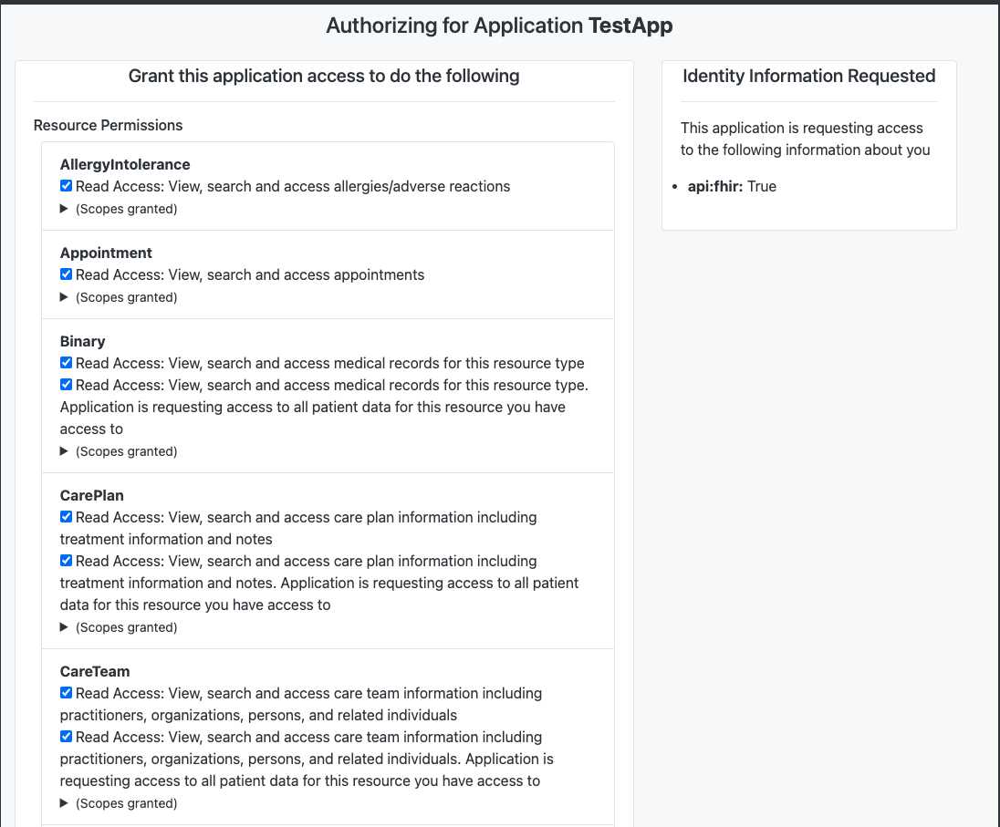
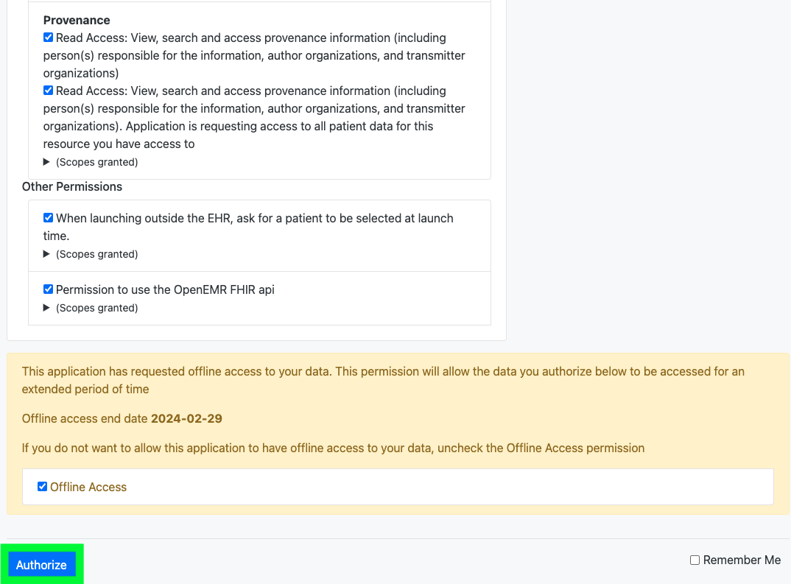
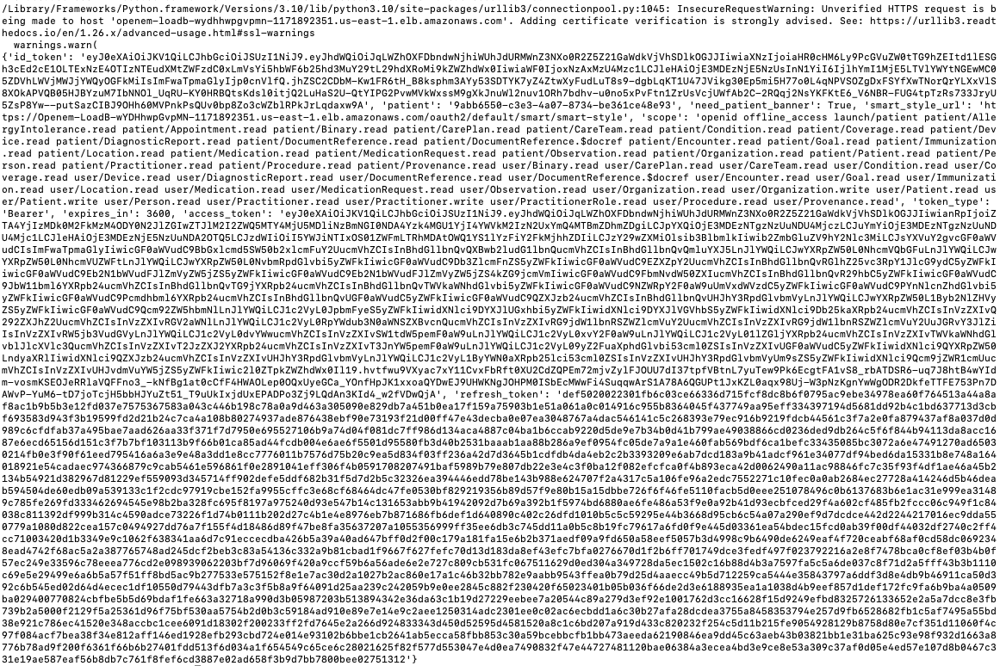

# OpenEMR on AWS Fargate

- [OpenEMR on AWS Fargate](#openemr-on-aws-fargate)
- [Disclaimers](#disclaimers)
    + [Third Party Packages](#third-party-packages)
    + [General](#general)
- [Instructions](#instructions)
    + [1. Installing dependencies](#1-installing-dependencies)
    + [2. IP Range Access](#2-ip-range-access)
    + [3. Accessing OpenEMR](#3-accessing-openemr)
- [Architecture](#architecture)
- [Cost](#cost)
- [Customizing Architecture Attributes](#customizing-architecture-attributes)
- [Enabling HTTPS for Client to Load Balancer Communication](#enabling-https-for-client-to-load-balancer-communication)
- [How AWS Backup is Used in this Architecture](#how-aws-backup-is-used-in-this-architecture)
- [Using ECS Exec](#using-ecs-exec)
- [Notes on HIPAA Compliance in General](#notes-on-hipaa-compliance-in-general)
- [REST and FHIR APIs](#rest-and-fhir-apis)
- [Regarding Security](#regarding-security)
    + [Using cdk_nag](#using-cdk-nag)
    + [Container Vulnerabilities](#container-vulnerabilities)
- [Useful commands](#useful-commands)

# Disclaimers

### Third Party Packages
This package depends on and may incorporate or retrieve a number of third-party
software packages (such as open source packages) at install-time or build-time
or run-time ("External Dependencies"). The External Dependencies are subject to
license terms that you must accept in order to use this package. If you do not
accept all of the applicable license terms, you should not use this package. We
recommend that you consult your company’s open source approval policy before
proceeding.

Provided below is a list of External Dependencies and the applicable license
identification as indicated by the documentation associated with the External
Dependencies as of Amazon's most recent review.

THIS INFORMATION IS PROVIDED FOR CONVENIENCE ONLY. AMAZON DOES NOT PROMISE THAT
THE LIST OR THE APPLICABLE TERMS AND CONDITIONS ARE COMPLETE, ACCURATE, OR
UP-TO-DATE, AND AMAZON WILL HAVE NO LIABILITY FOR ANY INACCURACIES. YOU SHOULD
CONSULT THE DOWNLOAD SITES FOR THE EXTERNAL DEPENDENCIES FOR THE MOST COMPLETE
AND UP-TO-DATE LICENSING INFORMATION.

YOUR USE OF THE EXTERNAL DEPENDENCIES IS AT YOUR SOLE RISK. IN NO EVENT WILL
AMAZON BE LIABLE FOR ANY DAMAGES, INCLUDING WITHOUT LIMITATION ANY DIRECT,
INDIRECT, CONSEQUENTIAL, SPECIAL, INCIDENTAL, OR PUNITIVE DAMAGES (INCLUDING
FOR ANY LOSS OF GOODWILL, BUSINESS INTERRUPTION, LOST PROFITS OR DATA, OR
COMPUTER FAILURE OR MALFUNCTION) ARISING FROM OR RELATING TO THE EXTERNAL
DEPENDENCIES, HOWEVER CAUSED AND REGARDLESS OF THE THEORY OF LIABILITY, EVEN
IF AMAZON HAS BEEN ADVISED OF THE POSSIBILITY OF SUCH DAMAGES. THESE LIMITATIONS
AND DISCLAIMERS APPLY EXCEPT TO THE EXTENT PROHIBITED BY APPLICABLE LAW.

 * openemr (Repository: https://github.com/openemr/openemr // License: https://github.com/openemr/openemr/blob/master/LICENSE) - GPL-3.0

### General

AWS does not represent or warrant that this AWS Content is production ready.  You are responsible for making your own independent assessment of the information, guidance, code and other AWS Content provided by AWS, which may include you performing your own independent testing, securing, and optimizing. You should take independent measures to ensure that you comply with your own specific quality control practices and standards, and to ensure that you comply with the local rules, laws, regulations, licenses and terms that apply to you and your content.  If you are in a regulated industry, you should take extra care to ensure that your use of this AWS Content, in combination with your own content, complies with applicable regulations (for example, the Health Insurance Portability and Accountability Act of 1996).   AWS does not make any representations, warranties or guarantees that this AWS Content will result in a particular outcome or result. 

# Instructions

These setup instructions assume that you've setup an AWS account and configured the AWS CDK. If you haven't done that we'd advise looking at [this documentation for setting up an AWS account](https://docs.aws.amazon.com/SetUp/latest/UserGuide/setup-overview.html) and [this documentation for setting up the AWS CDK](https://docs.aws.amazon.com/cdk/v2/guide/getting_started.html) before reviewing the instructions below. 

### 1. Installing dependencies

This project is set up like a standard Python project.  The initialization
process also creates a virtualenv within this project, stored under the `.venv`
directory.  To create the virtualenv it assumes that there is a `python3`
(or `python` for Windows) executable in your path with access to the `venv`
package. If for any reason the automatic creation of the virtualenv fails,
you can create the virtualenv manually.

To manually create a virtualenv on MacOS and Linux:

```
$ python3 -m venv .venv
```

After the init process completes and the virtualenv is created, you can use the following
step to activate your virtualenv.

```
$ source .venv/bin/activate
```

If you are a Windows platform, you would activate the virtualenv like this:

```
% .venv\Scripts\activate.bat
```

Once the virtualenv is activated, you can install the required dependencies.

```
$ pip install -r requirements.txt
```

Create ECS Service accounts.

```
$ aws iam create-service-linked-role --aws-service-name ecs.amazonaws.com --description "ECS Service Role"
$ aws iam create-service-linked-role --aws-service-name ecs.application-autoscaling.amazonaws.com --description "ECS Service Role for Application Autoscaling"
```

At this point you can now synthesize the CloudFormation template for this code.

```
$ cdk synth
```

You can also deploy using CDK as well.

```
$ cdk deploy
```

To add additional dependencies, for example other CDK libraries, just add
them to your `setup.py` file and rerun the `pip install -r requirements.txt`
command.

### 2. IP Range Access

By default, if you run `cdk deploy`, the security group that is assigned to the load balancer won't be open to the public internet. This is for security purposes. Instead we need to allowlist an IP range using the cdk.json file. As an example:

```
"security_group_ip_range": null
```

could be set to

```
"security_group_ip_range": "31.89.197.141/32",
```

Which will give access to only `31.89.197.141`.

### 3. Accessing OpenEMR

After we run `cdk deploy`, we will receive a url in the terminal. Going to that URL on our browser will take us to the OpenEMR authentication page.




Username is `admin` and password can be retrieved from [AWS Secrets Manager](https://aws.amazon.com/secrets-manager/). Navigate to the AWS console and go the Secrets Manager service. You will see a secret there which has a name that starts with `Password...`.


After entering username and password we should be able to get access to the OpenEMR UI.


# Architecture

This solution uses a variety of AWS services including [Amazon ECS](https://aws.amazon.com/ecs/), [AWS Fargate](https://aws.amazon.com/fargate/), [AWS WAF](https://aws.amazon.com/waf/), [Amazon CloudWatch](https://aws.amazon.com/cloudwatch/). For a full list you can review the cdk stack. Architecture diagram below shows how this solution comes together.



# Cost

You'll pay for the AWS resources you use with this architecture but since that will depend on your level of usage we'll compute an estimate of the base cost of this architecture (this will vary from region to region).

- Elasticache Serverless ($0.125/hour base cost)
- Aurora Serverless v2 ($0.12/hour base cost)
- AWS Fargate ($0.08612/hour base cost)
- 1 Application Load Balancer($0.0225/hour base cost)
- 2 NAT Gateways ($0.09/hour base cost)
- 2 Secrets Manager Secrets ($0.80/month)
- 1 WAF ACL ($5/month)

This works out to a base cost of $329.64/month. The true value of this architecture is its ability to rapidly autoscale and support even very large organizations. For smaller organizations you may want to consider looking at some of [OpenEMR's offerings in the AWS Marketplace](https://aws.amazon.com/marketplace/seller-profile?id=bec33905-edcb-4c30-b3ae-e2960a9a5ef4) which are more affordable.

# Customizing Architecture Attributes

There are some additional parameters you can set in `cdk.json` that you can use to customize some attributes of your architecture.

 * `openemr_service_fargate_minimum_capacity`       Minimum number of fargate tasks running in your ECS cluster for your ECS service running OpenEMR. Defaults to 2.
 * `openemr_service_fargate_maximum_capacity`      Maximum number of fargate tasks running in your ECS cluster for your ECS service running OpenEMR. Defaults to 100.
 * `openemr_service_fargate_cpu_autoscaling_percentage`        Percent of average CPU utilization across your ECS cluster that will trigger an autoscaling event for your ECS service running OpenEMR. Defaults to 40.
 * `openemr_service_fargate_memory_autoscaling_percentage`        Percent of average memory utilization across your ECS cluster that will trigger an autoscaling event for your ECS service running OpenEMR. Defaults to 40.
 * `enable_ecs_exec`          Can be used to toggle ECS Exec functionality. Set to a value other than "true" to disable this functionality. Please note that this should generally be disabled while running in production for most workloads. Defaults to "true".
 * `certificate_arn`          If specified will enable HTTPS for client to load balancer communications and will associate the specified certificate with the application load balancer for this architecture. This value, if specified, should be a string of an ARN in AWS Certificate Manager.
 * `activate_openemr_apis`          Setting this value to `"true"` will enable both the [REST](https://github.com/openemr/openemr/blob/master/API_README.md) and [FHIR](https://github.com/openemr/openemr/blob/master/FHIR_README.md) APIs. You'll need to authorize and generate a token to use most of the functionality of both APIs. Documentation on how authorization works can be found [here](https://github.com/openemr/openemr/blob/master/API_README.md#authorization). When the OpenEMR APIs are activated the `"/apis/"` and `"/oauth2"` paths will be accessible. To disable the REST and FHIR APIs for OpenEMR set this value to something other than "true". For more information about this functionality see the `REST and FHIR APIs` section of this documention. Defaults to "false".

# Enabling HTTPS for Client to Load Balancer Communication

If the value for `certificate_arn` is specified to be a string referring to the ARN of a certificate in AWS Certificate Manager this will enable HTTPS on the load balancer.

Incoming requests on port 80 will be automatically redirected to port 443 and port 443 will be accepting HTTPS traffic and the load balancer will be associated with the certificate specified.

The certificate used must be a public certificate. For documentation on how to issue and manage certificates with AWS Certificate Manager see [here](https://docs.aws.amazon.com/acm/latest/userguide/gs.html). For documentation on how to import certificates to AWS Certificate Manager see [here](https://docs.aws.amazon.com/acm/latest/userguide/import-certificate.html).

One of the advantages of issuing a certificate from AWS Certificate Manager is that AWS Certificate Manager provides managed renewal for AWS issued TLS/SSL certificates. For documentation on managed renewal in AWS Certificate Manager see [here](https://docs.aws.amazon.com/acm/latest/userguide/managed-renewal.html).

# How AWS Backup is Used in this Architecture

This architecture comes set up to use [AWS Backup](https://aws.amazon.com/backup/) and has automatic backups set up for both AWS EFSs and the RDS database.

The backup plan used is `daily_weekly_monthly7_year_retention` which will take daily, weekly and monthly backups with 7 year retention.

For documentation on AWS Backup see [here](https://docs.aws.amazon.com/aws-backup/latest/devguide/whatisbackup.html).

# Using ECS Exec

This architecture allows you to use ECS Exec to get a root command line prompt on a running container. Please note that this should generally be disabled while running in production for most workloads. For information on how to toggle this functionality see the `enable_ecs_exec` parameter in the `Customizing Architecture Attributes` section of this documentation.

For more instructions on how to use ECS Exec see [here](https://docs.aws.amazon.com/AmazonECS/latest/developerguide/ecs-exec.html#ecs-exec-enabling-and-using).

For an example of a command that could be run either in [AWS CloudShell](https://docs.aws.amazon.com/cloudshell/latest/userguide/welcome.html) or elsewhere to get root access to a container see the code below:

```
aws ecs execute-command --cluster $name_of_ecs_cluster \
    --task $arn_of_fargate_task \
    --container openemr \
    --interactive \
    --command "/bin/sh"
```

# Notes on HIPAA Compliance in General

If you are an AWS customer who is a HIPAA covered entity you would need to sign a business associate addendum (BAA) before running anything that would be considered in-scope for HIPAA on AWS.

Please note that you would have to sign a separate business associate addendum for _each AWS account_ where you would want to run anything that would be considered in-scope for HIPAA on AWS.

Documentation on HIPAA compliance on AWS in general and how one would sign a BAA can be found [here](https://aws.amazon.com/compliance/hipaa-compliance/).

You can use AWS Artifact in the AWS console to find and agree to the BAA. Documentation on getting started with using AWS Artifact can be found [here](https://aws.amazon.com/artifact/getting-started/).

While this may assist with complying with certain aspects of HIPAA we make no claims that this alone will result in compliance with HIPAA. Please see the general disclaimer at the top of this README for more information.

# REST and FHIR APIs

OpenEMR has functionality for both [FHIR](https://github.com/openemr/openemr/blob/master/FHIR_README.md) and [REST](https://github.com/openemr/openemr/blob/master/API_README.md) APIs. We'll walk through step-by-step example of how to generate a token to make calls to the FHIR and REST APIs. The script we'll use for this walkthough is the "api_endpoint_test.py" file found in the "scripts" folder in this repository.

To use the APIs you'll need to have HTTPS enabled for the communication from the client to the load balancer and to have the OpenEMR APIs turned on. As a result, before proceeding with the rest of this walkthrough make sure that in your `cdk.json` file you've specified an ACM certificate ARN for `certificate_arn` and that `activate_openemr_apis` is set to `"true"`.

1. Wait for the `cdk deploy` command to finish and for the stack to build. Then obtain the value for the DNS name of our ALB from either the Cloudformation console <br />  <br /> or the terminal you ran `cdk deploy` in <br /> 
2. Change directory to the `"scripts"` folder in this repository and run the "api_endpoint_test.py" script using the value obtained in part 1. That should look something like this <br />  <br /> and yield an output that looks like this <br />  <br /> at the bottom of the output you should see a message instructing you to "Enable the client with the above ID". 
3. To "Enable the client with the above ID" first copy the value in green below <br />  <br /> then log in to OpenEMR and navigate to the API Clients menu as shown below <br />  <br /> then in the menu find the registration where the Client ID corresponds with the value noted above <br />  <br /> and then click on the "edit" button next to that registration and in the following menu click the "Enable Client" button <br />  <br /> and if all goes well the client registration should now reflect that it is enabled like so <br /> .
4. Now that we've enabled our client let's go back to our script that's still running in our terminal and press enter to continue. We should get an output like this <br />  <br /> and our script has generated a URL we should go to to authorize our application. 
5. Before we navigate to that URL let's make a patient (in the event we didn't already have testing patient data imported) by going to the following menu <br />  <br /> and adding a fake patient for testing purposes with data and clicking the `"Create New Patient"` button like so <br /> 
6. Now let's navigate to the URL obtained in part 4 in our webbrowser where we should be prompted to login and should look like this <br /> . <br /> Log in with the admin user and password stored in secrets manager. 
7. Keep in mind that the next three steps are time sensitive. We're going to obtain a code in steps 8 and 9 that is short lived and needs to be used relatively quickly to get back an access token which can then be used to make API calls over an extended period of time. I'd recommend reading ahead for steps 8-10 so that you can step through them reasonably fast.
8. Then let's select our testing user <br />  <br /> which should bring us to a screen that looks like this <br />  <br /> and then scroll to the bottom of the page and click `"authorize"` <br /> 
9. Now in our example you're going to get a `"403 Forbidden"` page. That's totally fine! Notice the URL we were redirected to and copy everything after `?code=` up until `&state=` to your clipboard <br />  <br /> At this stage in the process you've registered an API client, enabled it in the console, authorized and gotten a code which we've copied to our clipboard.
10. Let's navigate back to our script that's running in the terminal and press enter to proceed. The next prompt should be instructing us to "Copy the code in the redirect link and then press enter." which if all went well in part 8 should already be done. Now let's press enter to proceed. We should see the code we copied appear in the terminal like so <br />  <br /> followed by a response containing an access token that can be used to make authenticatecd API calls that looks like this <br /> 

# Regarding Security

### Using cdk_nag

We instrumented this project with [cdk_nag](https://github.com/cdklabs/cdk-nag). In your app.py file we placed 2 commented out cdk_nag checks.

```python
from cdk_nag import AwsSolutionsChecks, HIPAASecurityChecks

app = cdk.App()
cdk.Aspects.of(app).add(AwsSolutionsChecks(verbose=True))
cdk.Aspects.of(app).add(HIPAASecurityChecks(verbose=True))
```

If you'd like you can enable the cdk_nag checks and fix any issues found therein. While this may assist with complying with certain aspects of HIPAA we make no claims that this alone will result in compliance with HIPAA. Please see the general disclaimer at the top of this README for more information. 

### Container Vulnerabilities

We recommend periodically scanning the container image used in this project. There are multiple ways to achieve that goal. 2 of them are:

1. Upload the container image to ECR and enable scanning
2. You can use [trivy](https://github.com/aquasecurity/trivy)

# Useful commands

 * `cdk ls`          list all stacks in the app
 * `cdk synth`       emits the synthesized CloudFormation template
 * `cdk deploy`      deploy this stack to your default AWS account/region
 * `cdk diff`        compare deployed stack with current state
 * `cdk docs`        open CDK documentation

